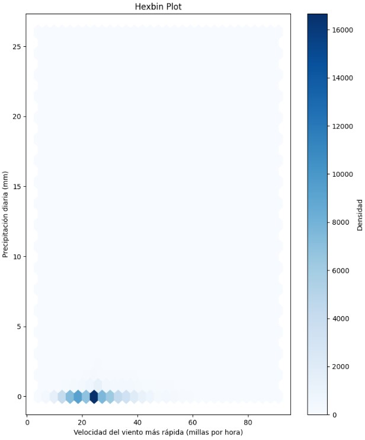

# Guía 4: Exploración de Datos Climáticos en Estados Unidos (2017)

## Descripción del Proyecto

Este proyecto aborda el análisis exploratorio de un dataset que contiene reportes meteorológicos diarios en estaciones de EE.UU. durante los primeros 9 meses del 2017. El objetivo principal es extraer insights significativos sobre las variaciones en la temperatura, la precipitación y la velocidad del viento, y relacionar estas variables con las estaciones meteorológicas y los meses del año.

## Objetivos:

1. Entender la variabilidad de la temperatura en Estados Unidos a lo largo del año 2017.
2. Analizar la relación entre la velocidad del viento y las precipitaciones.
3. Identificar si existe una cantidad considerable de estaciones meteorológicas con velocidades de viento altas.
4. Evaluar cómo varía la precipitación en diferentes estaciones meteorológicas y a lo largo de los meses.

## Dataset:

- **Fuente**: Daily Global Historical Climatology Network (NOAA)
- **Variables principales**:

  * **estacion**: Nombre del estación (**aeropuerto**) que reporta los datos.
    - **Ejemplo**: `GUAM INTL AP`
  * **estado**: Siglas del estado o territorio en el que se encuentra la estación meteorológica.
    - **Ejemplo**: `GU` (Guam)
  * **latitud**: Latitud geográfica de la estación en grados decimales.
    - **Ejemplo**: `13.4836`
  * **longitud**: Longitud geográfica de la estación en grados decimales.
    - **Ejemplo**: `144.7961`
  * **msnm**: Elevación sobre el nivel del mar de la estación meteorológica en metros.
    - **Ejemplo**: `77.4`
  * **TEMPERATURA_CELSIUS**: Temperatura promedio diaria en grados Celsius.
    - **Ejemplo**: `26.7`
  * **VELOCIDAD_MEDIA_DIARIA_VIENTO_MILLAS_POR_HORA**: Velocidad media diaria del viento medida en millas por hora.
    - **Ejemplo**: `4.47`
  * **DIRECCION_VIENTO_MAS_RAPIDA_5_SEC_GRADOS**: Dirección del viento más rápida en los últimos 5 segundos, medida en grados.
    - **Ejemplo**: `360.0` (dirección norte)
  * **VELOCIDAD_VIENTO_MAS_RAPIDA_5_SEC_MILLAS_POR_HORA**: Velocidad máxima del viento registrada en un intervalo de 5 segundos, medida en millas por hora.
    - **Ejemplo**: `21.03`
  * **PRECIPITACION_mm**: Precipitación diaria total medida en milímetros.
    - **Ejemplo**: `0.0` (sin precipitaciones)
  * **mes**: Mes del año en que se registraron los datos.
    - **Ejemplo**: `3` (marzo)
  * **dia**: Día del mes en que se registraron los datos.
    - **Ejemplo**: `12`
  * **rango_estacion**: Rango al que pertenece una estación meteorológica basado en las precipitaciones totales registradas durante el año.
    - **Ejemplo**: `Rango 1` (estaciones con baja precipitación)
   
**Tabla de siglas de estados en Estados Unidos**


## Proceso:

### 1. Limpieza de datos:

- Se eliminaron columnas irrelevantes y se imputaron valores faltantes.
- Muestra inicial del dataset => 416 937 filas y 15 columnas.
```python
df = pd.read_csv('weather.csv')
print(f'Cantidad de filas: {df.shape[0]}')
print(f'Cantidad de columnas: {df.shape[1]}')
df.head()
```


- Primer threshold, si hay 30% o más de NAs, borrar esos datos.

```python
# Delete rows with NAs proportion > 30%

def delete_na(df):
    for i in df.columns:
        if df[i].isna().sum() > 0:
            if round(df[i].isna().sum()/df.shape[0] * 100,3) > 30:
                df.dropna(subset=[i], inplace=True)
    return df

delete_na(df)
```
- Función para resetear los índices

```python
# reset index in df
def reset_index(df):
    df.reset_index(drop=True, inplace=True)
    return df

reset_index(df)
```

- Renombrado de columnas, formato traducido

```python
# renombremos las columnas con su traducción al español
df.columns = ['estacion', 'estado', 'latitud', 'longitud', 'msnm', 'fecha', 
              'TMIN_CELSIUS', 'TMAX_CELSIUS', 'TAVG_CELSIUS', 
              'VELOCIDAD_MEDIA_DIARIA_VIENTO_MILLAS_POR_HORA', 
              'DIRECCION_VIENTO_MAS_RAPIDA_5_SEC_GRADOS', 
              'VELOCIDAD_VIENTO_MAS_RAPIDA_5_SEC_MILLAS_POR_HORA', 
              'NIEVE_mm', 'PROFUNDIDAD_NIEVE_mm', 'PRECIPITACION_mm']

df.head()
```

- Separemos date en día, mes y año, borremos date.
- Pasemos fareneheint a celsius.

```python
# pasarlo a una función
def date_features(df):
    df['fecha'] = pd.to_datetime(df['fecha'], format='%Y%m%d')
    df['año'] = df['fecha'].dt.year
    df['mes'] = df['fecha'].dt.month
    df['dia'] = df['fecha'].dt.day
    df.drop(columns='fecha', inplace=True)
    return df

# pasarlo a una funcion
def fahrenheit_to_celsius(df):
    df['TMIN_CELSIUS'] = (df['TMIN_CELSIUS'] - 32) * 5/9
    df['TMAX_CELSIUS'] = (df['TMAX_CELSIUS'] - 32) * 5/9
    df['TAVG_CELSIUS'] = (df['TAVG_CELSIUS'] - 32) * 5/9
    return df

date_features(df)
fahrenheit_to_celsius(df)
```

- El dataset se ha reducido a:


- Veamos la proporción de NAs ahora.
```python
# NAs en cada columna
def show_na(df):
    for i in df.columns:
        if df[i].isna().sum() > 0:
            print('-----------------')
            print(i, df[i].isna().sum())
            #print(df[i].unique())
            
show_na(df)
```


- Hagamos un lineplot de las temperaturas, a ver si son correctas.

```python
# lineplot de TMIN_CELSIUS, TMIX_CELSIUS y TAVG_CELSIUS
plt.figure(figsize=(10,6))
sns.lineplot(data=df['TMIN_CELSIUS'], color='blue', label='TMIN_CELSIUS')
sns.lineplot(data=df['TMAX_CELSIUS'], color='red', label='TMAX_CELSIUS')
sns.lineplot(data=df['TAVG_CELSIUS'], color='green', label='TAVG_CELSIUS')
plt.legend()
plt.title('Lineplot de TMIN_CELSIUS, TMAX_CELSIUS y TAVG_CELSIUS')
plt.xlabel('Frecuencia')
plt.ylabel('Temperatura en Celsius')
plt.grid()
plt.show()
```


- Imputación Basada en la Relación con TAVG_CELSIUS: Dado que TAVG_CELSIUS es el promedio de TMIN_CELSIUS y TMAX_CELSIUS, podemos usar esta relación para imputar los valores faltantes.
Primero imputemos TMIN con la media, luego imputaremos TMAX con la relación correspondiente
$2 * \text{TAVG CELSIUS} - \text{TMIN CELSIUS} = \text{TMAX CELSIUS}$

```python
import pandas as pd

# Paso 1: Imputar valores faltantes con la media o mediana
# Puedes elegir entre media o mediana. Aquí usamos la media, ignorar los valores faltantes en la media
tmin_mean = df['TMIN_CELSIUS'].mean()

# reemplazar los valores faltantes con la media
df['TMIN_CELSIUS'] = df['TMIN_CELSIUS'].fillna(tmin_mean)

# Paso 2: Imputar valores faltantes en TMIN_CELSIUS y TMAX_CELSIUS basados en TAVG_CELSIUS
# Imputar valores faltantes en TMAX_CELSIUS
df['TMAX_CELSIUS'] = df.apply(
    lambda row: 2 * row['TAVG_CELSIUS'] - row['TMIN_CELSIUS'] if pd.isnull(row['TMAX_CELSIUS']) else row['TMAX_CELSIUS'],
    axis=1
)

# Verificar que no hay valores faltantes
show_na_prop(df)
plt.show()
```

- Usaremos la mediana para recupear los datos de las **precipitaciones**, ya que su proporción es inferior al 1%.

```python
# reemplazar los na en PRECIPIACION_mm por la mediana
prcp_median = df['PRECIPITACION_mm'].median()

df['PRECIPITACION_mm'] = df['PRECIPITACION_mm'].fillna(prcp_median)

show_na_prop(df)
```

- Para recuperar los datos relacionados al viento (velocidad media más rápida en mph y dirección del viento más rápida en grados), esto debido a que al visualizar el dataset, ambos tienen los NAs en lo mismo lugar prácticamente, como la columna **velocidad media del viento** está completa y limpia, podemos usarn **KNN imputation** para recuperar primero una de las columnas, y luego la siguiente.

```python
#uso de knn para imputar valores faltantes para velocidad del viento y dirección del viento
from sklearn.impute import KNNImputer


# Paso 1: Crear un objeto KNNImputer
knn_imputer = KNNImputer(n_neighbors=5)

# Paso 2: Imputar valores faltantes
# Seleccionar las columnas que tienen valores faltantes
columns = ['DIRECCION_VIENTO_MAS_RAPIDA_5_SEC_GRADOS', 'VELOCIDAD_VIENTO_MAS_RAPIDA_5_SEC_MILLAS_POR_HORA']

# Imputar valores faltantes
df[columns] = knn_imputer.fit_transform(df[columns])

# resetear el índice
reset_index(df)

# Verificar que no hay valores faltantes
show_na_prop(df)
```


- ¿Realmente vale la pena usar la nieve como medidor meteorológico? Es un medidor que no se usará realmente en el análisis, sería mucho mejor segregarlo en grupos. Estas 2 columnas serán eliminadas del dataset.

```python
# borrar las columnas de nieve
df.drop(columns=['NIEVE_mm', 'PROFUNDIDAD_NIEVE_mm'], inplace=True)

# verificar que no hay valores faltantes
show_na_prop(df)
```

Muestra del dataset final:


- Analizando el año, mes y día, el análisis ocurre solo en el 2017, por lo que la columna año será eliminada. Por otro lado, se presentan meses de enero a setiembre solamente, intuyendo que el análisis fue realizado del 01 de enero de 2017 hasta el 30 de setiembre del mismo.

```python
df['año'].unique()
df['mes'].unique()
df['dia'].unique()
```


Por lo que borraremos la columna año, resetearemos los índices, y redondearemos a 2 decimales las columnas que lo requieran(para una visualización más cómoda) y finalmente tendremos nuestro dataset limpio, con 80 093 filas y 14 columnas.

```python
#borrar la columna año
df.drop(columns='año', inplace=True)
# resetear indice
reset_index(df)
# redondear a 2 decimales las columnas: VELOCIDAD_MEDIA_DIARIA_VIENTO_MILLAS_POR_HORA, VELOCIDAD_VIENTO_MAS_RAPIDA_5_SEC_MILLAS_POR_HORA, PRECIPITACION_mm

df['DIRECCION_VIENTO_MAS_RAPIDA_5_SEC_GRADOS'] = df['DIRECCION_VIENTO_MAS_RAPIDA_5_SEC_GRADOS'].round(2)
df['VELOCIDAD_MEDIA_DIARIA_VIENTO_MILLAS_POR_HORA'] = df['VELOCIDAD_MEDIA_DIARIA_VIENTO_MILLAS_POR_HORA'].round(2)
df['VELOCIDAD_VIENTO_MAS_RAPIDA_5_SEC_MILLAS_POR_HORA'] = df['VELOCIDAD_VIENTO_MAS_RAPIDA_5_SEC_MILLAS_POR_HORA'].round(2)
df['PRECIPITACION_mm'] = df['PRECIPITACION_mm'].round(2)
```


- Veamos un lineplot de las temperaturas nuevamente, verifiquemos que no se haya generado ningún sesgo al haber recuperado por la **media** y luego reemplazar en la fórmula de promedio.

```python
# lineplot de TMIN_CELSIUS, TMIX_CELSIUS y TAVG_CELSIUS

plt.figure(figsize=(10,6))
sns.lineplot(data=df['TMIN_CELSIUS'], color='blue', label='TMIN_CELSIUS')
sns.lineplot(data=df['TMAX_CELSIUS'], color='red', label='TMAX_CELSIUS')
sns.lineplot(data=df['TAVG_CELSIUS'], color='green', label='TAVG_CELSIUS')
plt.legend()
plt.title('Lineplot de TMIN_CELSIUS, TMAX_CELSIUS y TAVG_CELSIUS')
plt.xlabel('Frecuencia')
plt.ylabel('Temperatura en Celsius')
plt.grid()
plt.show()
```


- Como era de esperarse, se generó un tremendo sesgo para la temperatura máxima en celsius, debido a que este estudio se centra en predecir la temperatura media, procederemos a **descartar sus mínimos y máximos**, quedándonos con 12 columnas y sin columnas que puedan sesgar el análisis.

```python
# borrar TMIN_CELSIUS y TMAX_CELSIUS
df.drop(columns=['TMIN_CELSIUS', 'TMAX_CELSIUS'], inplace=True)

# resetear el índice
reset_index(df)
```

- Además, renombremos la única temperatura a TEMPERATURA_CELSIUS.

```python
# renombrar la columna TAVG_CELSIUS a TEMPERATURA_CELSIUS
df.rename(columns={'TAVG_CELSIUS': 'TEMPERATURA_CELSIUS'}, inplace=True)

# resetear el índice
reset_index(df)
```


- Finalmente guardamos el dataset limpio en un csv

```python
# guardar el df limpio como weather_clean.csv
df.to_csv('weather_clean.csv', index=False)
```

### 2. Análisis Exploratorio de Datos:

a) **Temperatura**: Se analizó la variación de la temperatura a lo largo de los meses, mostrando un incremento progresivo hasta el verano.

```python
import pandas as pd
import seaborn as sns
import matplotlib.pyplot as plt

# Crear un nuevo DataFrame con 'mes' y 'dia' como índice
df_new = df.copy()
df_new.set_index(['mes', 'dia'], inplace=True)

# Asegurarse de que los valores en 'TEMPERATURA_CELSIUS' sean numéricos
df_new['TEMPERATURA_CELSIUS'] = pd.to_numeric(df_new['TEMPERATURA_CELSIUS'], errors='coerce')

# Eliminar filas con valores NaN en 'TEMPERATURA_CELSIUS'
df_new.dropna(subset=['TEMPERATURA_CELSIUS'], inplace=True)

# Graficar la serie de tiempo de la temperatura
plt.figure(figsize=(10, 6))
sns.lineplot(data=df_new.reset_index(), x='mes', y='TEMPERATURA_CELSIUS', hue='dia', palette='viridis', legend='auto')

# Agregar una línea adicional en la serie de tiempo
# Por ejemplo, una línea horizontal en la temperatura media
mean_temp = df_new['TEMPERATURA_CELSIUS'].mean()
plt.axhline(y=mean_temp, color='red', linestyle='--', label=f'Temperatura Media: {mean_temp:.2f}°C')

plt.title('Serie de tiempo de la temperatura')
plt.xlabel('Mes y Día')
plt.ylabel('Temperatura en Celsius')
plt.legend()
plt.grid()
plt.show()
```


Podemos apreciar que la visualización coincide con la ubicación geográfica en la que se hizo el reporte diario. ¿Cómo nos damos cuenta de esto?

El análisis de datos es en base a un **reporte climatológico registrado en diferentes estaciones en los Estados Unidos en el año 2017 en los 9 primeros meses de dicho año**. Dichas estaciones, son **aeropuertos**.

Dicha serie temporal, muestra como la temperatura promedio a lo largo del año es de aprox 14.01 grados centígrados. Su variación es creciente hasta aprox el mes de julio y agosto, lo cual muestra el solsticio de verano en el **hemisferio norte**, ya que es de saber que funciona así:

- Solsticio de Invierno: Diciembre (mes12) => Marzo (mes 3) 
- Equinoccio de Primavera: Marzo (mes 3) => Junio (mes 6) 
- Solsticio de Verano: Junio (mes 6) => Setiembre (mes 9) 
- Equinoccio de Otoño: Setiembre (mes 9) => Diciembre (mes 12)

Fuente: (https://www.metoffice.gov.uk/weather/learn-about/weather/seasons/equinox-and-solstice#:~:text=The%20Equinox%20in%20the%20Northern,September%20(the%20autumn%20equinox).)

b) **Velocidad del viento vs Precipitación**: Se investigó si existía alguna correlación significativa, concluyendo que los días con viento fuerte no necesariamente traen lluvias intensas.

```python
# Scatter plot entre velocidad del viento más rápida y precipitación
plt.figure(figsize=(8, 6))
sns.scatterplot(data=df, x='VELOCIDAD_VIENTO_MAS_RAPIDA_5_SEC_MILLAS_POR_HORA', y='PRECIPITACION_mm', hue='estacion', alpha=0.7)
plt.title('Relación entre Velocidad del Viento más Rápida y Precipitación')
plt.xlabel('Velocidad del Viento más Rápida (millas/h)')
plt.ylabel('Precipitación (mm)')
plt.grid(True)
plt.legend(bbox_to_anchor=(1.05, 1), loc='upper left')
plt.tight_layout()
plt.show()
```


**Distribución de la precipitación respecto a la velocidad del viento**:
   - La mayoría de los puntos de datos están concentrados en los valores bajos de precipitación (menores a 5 mm) y velocidad del viento (menores a 40 a 60 millas por hora). Esto indica que en la mayoría de los casos, **no hay precipitaciones extremadamente altas cuando la velocidad del viento es alta, sugiriendo que estos fenómenos pueden no estar fuertemente correlacionados.**

```python
import pandas as pd
import seaborn as sns
import matplotlib.pyplot as plt

# Crear una figura con subplots
fig, axes = plt.subplots(2, 2, figsize=(15, 18))

# Gráfico de Dispersión (Scatter Plot)
sns.scatterplot(data=df, x='VELOCIDAD_VIENTO_MAS_RAPIDA_5_SEC_MILLAS_POR_HORA', y='PRECIPITACION_mm', color='blue', ax=axes[0, 0])
axes[0, 0].set_title('Scatter Plot')
axes[0, 0].set_xlabel('Velocidad del viento más rápida (millas por hora)')
axes[0, 0].set_ylabel('Precipitación diaria (mm)')

# Gráfico de Regresión (Regresión Lineal)
sns.regplot(data=df, x='VELOCIDAD_VIENTO_MAS_RAPIDA_5_SEC_MILLAS_POR_HORA', y='PRECIPITACION_mm', color='blue', line_kws={"color": "red"}, ax=axes[0, 1])
axes[0, 1].set_title('Regresión Lineal')
axes[0, 1].set_xlabel('Velocidad del viento más rápida (millas por hora)')
axes[0, 1].set_ylabel('Precipitación diaria (mm)')

# Gráfico de Hexágonos (Hexbin Plot)
hb = axes[1, 0].hexbin(df['VELOCIDAD_VIENTO_MAS_RAPIDA_5_SEC_MILLAS_POR_HORA'], df['PRECIPITACION_mm'], gridsize=30, cmap='Blues')
axes[1, 0].set_title('Hexbin Plot')
axes[1, 0].set_xlabel('Velocidad del viento más rápida (millas por hora)')
axes[1, 0].set_ylabel('Precipitación diaria (mm)')
fig.colorbar(hb, ax=axes[1, 0], label='Densidad')

# Ajustar el layout para evitar solapamientos
plt.tight_layout()

plt.show()
```




Visualización 2: **Regresión lineal**:
- La línea de regresión (con una pendiente casi horizontal) refuerza la idea de que hay muy poca correlación entre la velocidad del viento más rápida y la cantidad de precipitación. **Esto puede implicar que, a pesar de los fuertes vientos, no siempre se asocian con lluvias intensas.**

Visualización 3: **Hexbin Plot**:
- El hexbin plot muestra una concentración más densa en valores bajos de velocidad del viento y precipitación, lo que respalda la observación de que la mayoría de los días con viento no presentan precipitaciones significativas. Por lo que, la baja densidad en velocidades superiores a las 60 mph también refuerza la rareza de fenómenos climáticos extremos con alta velocidad del viento y alta precipitación.

**Conclusión:**
En base a los gráficos, podemos decir que **no parece haber una correlación significativa entre la velocidad del viento más rápida y la precipitación**. Esto podría implicar que los días con fuertes vientos no necesariamente traen precipitaciones intensas, al menos en los datos analizados. Este tipo de hallazgo es importante para estudios sobre la predicción de fenómenos meteorológicos.


c) **Identificación de la proporción de estaciones con mayor viento**: Se identificaron las estaciones que experimentaron mayores velocidades de viento promedio diario.

```python
import pandas as pd
import seaborn as sns
import matplotlib.pyplot as plt

# Calcular la velocidad media diaria del viento por estación meteorológica
avg_wind_speed = df.groupby('estacion')['VELOCIDAD_MEDIA_DIARIA_VIENTO_MILLAS_POR_HORA'].mean()

# Crear rangos para la velocidad media diaria del viento
num_bins = 3
bins = pd.cut(avg_wind_speed, bins=num_bins)

# Contar el número de estaciones en cada rango
wind_speed_ranges = bins.value_counts().sort_index()

# Crear un gráfico de barras
plt.figure(figsize=(12, 6))
sns.barplot(x=wind_speed_ranges.index.astype(str), y=wind_speed_ranges.values, palette='viridis')
plt.title('Distribución de la Velocidad Media Diaria del Viento por Rangos (Año 2017)')
plt.xlabel('Rangos de Velocidad Media Diaria del Viento (millas por hora)')
plt.ylabel('Número de Estaciones Meteorológicas')
plt.xticks(rotation=45)
plt.grid(axis='y')
plt.show()
```


**Velocidad media diaria del viento por estación**:
- Observamos que hay una **variación significativa en la velocidad media diaria del viento** entre las diferentes estaciones meteorológicas. Sin embargo, la mayoría de las estaciones presentan velocidades de viento relativamente bajas (menos de 30 millas por hora). Solo algunas estaciones se destacan con velocidades medias más altas registradas.
   
**Distribución de la velocidad del viento por rangos**:
- La distribución muestra que la mayoría de las estaciones están concentradas en el rango más bajo de velocidad del viento (entre 0.56 y 27.87 millas por hora). **Esto implica que los vientos más fuertes son poco comunes en la mayoría de las estaciones registradas.** Muy pocas estaciones tienen vientos con velocidades promedio superiores a 55 millas por hora.
   
**Relevancia para estudios climáticos**:
- Este análisis es útil para identificar las **regiones con mayores vientos promedio**, que pueden ser zonas relevantes para la generación de energía eólica o para la planificación de infraestructuras resistentes al viento. También puede ser interesante correlacionar estas zonas con otras variables climáticas para detectar posibles patrones.

**Posible conclusión:**
La mayoría de las estaciones meteorológicas en los EE.UU. en 2017 experimentaron velocidades de viento relativamente moderadas, con solo algunas estaciones mostrando vientos significativamente más altos. Este tipo de información puede ser útil para estudios de infraestructura y energías renovables, además de ayudar a planificar mejor en áreas vulnerables a vientos fuertes. 

Por otro lado, **este análisis cubre los 9 primeros meses del año**, combinando nuestro primer insight (Visualización de variación de la temperatura media) los últimos 3 meses del año pertenecen al **equinoccio de otoño**, justamente el período del año con mayor incidencia de viento.

Fuente: (https://www.quora.com/Why-does-the-wind-blow-extra-hard-in-the-Autumn)


d) **Precipitación total por estación**: Para poder analizar las estaciones con mayor número de precipitaciones, debido a la alta cantidad de estaciones, se optó por segregar en 5 rangos, para poder visualizar si existe una cantidad considerable de estaciones con un número alto de precipitaciones, lo cual resultó no ser cierto, pues solo uno de los 5 rangos presentaba precipitaciones relativamente intensas.

```python
import pandas as pd
import seaborn as sns
import matplotlib.pyplot as plt

# Calcular la precipitación total por estación meteorológica
total_precipitation = df.groupby('estacion')['PRECIPITACION_mm'].sum()

# Crear rangos para las estaciones meteorológicas
num_bins = 5
bins = pd.cut(total_precipitation, bins=num_bins, labels=[f'Rango {i+1}' for i in range(num_bins)])

# Asignar los rangos al DataFrame original
df['rango_estacion'] = df['estacion'].map(bins)

# Crear un gráfico de barras agrupado por mes y rango de estación meteorológica
plt.figure(figsize=(12, 6))
sns.barplot(data=df, x='rango_estacion', y='PRECIPITACION_mm', hue='mes', palette='viridis')
plt.title('Precipitación Total por Mes y Rango de Estación Meteorológica')
plt.xlabel('Rango de Estación Meteorológica')
plt.ylabel('Precipitación Total (mm)')
plt.legend(title='Mes', bbox_to_anchor=(1.05, 1), loc='upper left')
plt.grid(axis='y')
plt.show()
```


**Precipitación total por mes y estación**:
- Las estaciones meteorológicas clasificadas en el **Rango 5** (las que experimentaron las precipitaciones más altas) muestran una mayor variabilidad en la precipitación total, especialmente en el mes 8 (agosto). Esto podría indicar que estas estaciones están ubicadas en regiones más propensas a lluvias intensas o en áreas geográficas específicas con climas más húmedos. En contraste, las estaciones en los **Rangos 1, 2 y 3** experimentaron precipitaciones mucho más bajas y constantes a lo largo de los meses, lo que sugiere que están ubicadas en regiones más secas o menos propensas a lluvias intensas.

**Variación mensual**:
- La precipitación tiende a aumentar en los meses de verano (6 a 9), lo cual puede estar asociado con **ciclones tropicales, tormentas de verano** u otros fenómenos meteorológicos estacionales comunes en esas fechas. En los primeros meses del año (1 y 3), la precipitación es generalmente más baja en todos los rangos, lo que sugiere que en esas estaciones no hay grandes tormentas o fenómenos relacionados con lluvias, pero sí cabe la posibilidad de **que la nieve sea frecuente**.

**Rangos de estaciones**:
- El análisis de rangos de estaciones meteorológicas muestra que solo unas pocas estaciones (en los rangos superiores) contribuyen a las precipitaciones más altas, mientras que la mayoría de las estaciones tienen valores bajos de precipitación. Esto puede estar relacionado con la **distribución geográfica** de las estaciones, donde ciertas regiones (probablemente costeras o montañosas) experimentan lluvias más intensas.

**Conclusión preliminar:**
Las precipitaciones varían considerablemente entre las estaciones meteorológicas y los meses del año, con una mayor concentración de lluvias en ciertos meses de verano y en estaciones específicas que registran las mayores precipitaciones. Este tipo de análisis es relevante para la gestión de recursos hídricos y la preparación ante eventos climáticos extremos.

e) **CASO PARTICULAR: ITINERARIO DE VIAJE**


Debido a que todas las **estaciones son aeropuertos**, y la cantidad de aeropuertos en EEUU es muy grande, nos centraremos en un solo estado, el cual es el estado más concurrido del país, **Florida**.

Fuente: (https://www.airalo.com/blog/the-top-5-us-states-to-visit-for-international-travelers#:~:text=1.,Florida&text=Florida%20saw%20just%20a%20nearly,Disney%20World%20and%20Universal%20Studios)

En base a lo encontrado, les presento a 2 personas, ellos son Yhair Huertas y Luis Cubillas, **2 grandes amigos amantes del clima cálido**, es por ello que se han planteado como objetivo realizar un viaje a los Estados Unidos, con destino a **Florida**. Ellos han investigado y saben que su lugar de destino está situado en la costa del país y el clima es ideal para su gusto.

Es por ello que recurren a datos metereológicos, de manera que puedan predecir la temperatura en **Florida** en diferentes épocas del año.

### 3. Selección de Características:

- Las variables categóricas (estación, estado) fueron codificadas mediante **label encoding**.
- Se aplicaron técnicas de **filtro** como el **mapa de correlación** y la **ganancia de información** para seleccionar las características más importantes para predecir la temperatura: **mes**, **rango_estacion** y **velocidad media del viento**.

#### Dataset filtrado para Florida

- Cuenta con 3107 filas y 13 columnas (las 12 del dataset limpio y el rango_estacion que considera **la intensidad de las precipitaciones y la estación(Aeropuerto) en el que se registró**).

```python
## primero filtremos el estado FL (Florida)
df_fl_ap = df[(df['estado'] == 'FL')]
reset_index(df_fl_ap)
df_fl_ap
```


#### Motrar estaciones únicas en el dataset de Florida

- 12 estaciones únicas.

```python
df_fl_ap['estacion'].unique()
```


#### Mostrar los rangos de estaciones únicas en el dataset de Florida

- 3 rangos únicos (rango 2,3 y 4).

```python
df_fl_ap['rango_estacion'].unique()
```


Al filtrar en el estado de Florida, solo nos quedamos con los rangos 2, 3 y 4 de estaciones clusterizadas, las cuales **presentan precipitaciones muy ligeras**, priorizando el calor y no la humedad. 

Conozcamos que estaciones forman parte de cada rango.


**Los amigos, amantes del clima cálido, deberían tener en cuenta los lugares con menor **intensidad de precipitaciones**. Por lo que aquellos pertenecientes al rango 2 o 3, deberían ser la prioridad de visita.**

Dibujemos el mapa de florida y las **estaciones en este**.

```python
# Dibujemos el mapa de Florida y las estaciones en este.

import osmnx
import geopandas as gpd
import matplotlib.pyplot as plt

# Crear un mapa de Florida
florida = osmnx.geocode_to_gdf('Florida, USA')

# Crear un GeoDataFrame con las estaciones meteorológicas en Florida
gdf_stations = gpd.GeoDataFrame(df_fl_ap, geometry=gpd.points_from_xy(df_fl_ap['longitud'], df_fl_ap['latitud']))

# Crear un mapa de Florida con las estaciones meteorológicas
fig, ax = plt.subplots(figsize=(12, 12))
florida.plot(ax=ax, facecolor='lightblue', edgecolor='gray')
gdf_stations.plot(ax=ax, color='red', label='Estaciones Meteorológicas')

# Agregar el nombre de cada estación y su rango en el mapa
for x, y, label, rango in zip(gdf_stations.geometry.x, gdf_stations.geometry.y, gdf_stations['estacion'], gdf_stations['rango_estacion']):
    ax.annotate(f'{label}\n{rango}', xy=(x, y), xytext=(3, 3), textcoords='offset points', fontsize=8, color='black')

plt.title('Estaciones Meteorológicas en Florida')
plt.xlabel('Longitud')
plt.ylabel('Latitud')
plt.legend()
plt.grid()
plt.show()
```


Ahora veamos donde se encuentra la temperatura media mayor según cada estación.

```python
# Ahora veamos donde se encuentra la temperatura media mayor según cada estación meteorológica en Florida.

import pandas as pd
import geopandas as gpd
import matplotlib.pyplot as plt

# Calcular la temperatura media por estación meteorológica y por mes
avg_temp_monthly = df_fl_ap.groupby(['estacion', 'mes'])['TEMPERATURA_CELSIUS'].mean().reset_index()

# Calcular la temperatura media anual por estación meteorológica
avg_temp_annual = avg_temp_monthly.groupby('estacion')['TEMPERATURA_CELSIUS'].mean()

# Unir la temperatura media anual con el GeoDataFrame de estaciones
gdf_stations['TEMPERATURA_MEDIA'] = gdf_stations['estacion'].map(avg_temp_annual)

# Crear un mapa de Florida con las estaciones meteorológicas y la temperatura media
fig, ax = plt.subplots(figsize=(9, 9))
florida.plot(ax=ax, facecolor='lightblue', edgecolor='gray')
gdf_stations.plot(ax=ax, column='TEMPERATURA_MEDIA', cmap='coolwarm', legend=True, legend_kwds={'label': 'Temperatura Media (°C)'})

# Agregar el nombre de cada estación en el mapa
for x, y, label in zip(gdf_stations.geometry.x, gdf_stations.geometry.y, gdf_stations['estacion']):
    ax.annotate(label, xy=(x, y), xytext=(3, 3), textcoords='offset points', fontsize=8, color='black')

plt.title('Temperatura Media Anual por Estación Meteorológica en Florida')
plt.xlabel('Longitud')
plt.ylabel('Latitud')
plt.grid()
plt.show()
```


En el mapa podemos observar, **que mientras más te acercas al polo norte, más temperatura media tendrás**, es por ello que los lados con menor latitud tienden a ser más calientes.

Entonces, un buen **route map** que podrían seguir nuestros amigos **Yhair y Luis** es priorizar los viajes con menor latitud, para una visita de 3 lugares podría ser:

1. Verd Beach
2. Lauderdale
3. Key West

De esta manera, se aprovecha el clima tropical cálida que caracteriza al estado de Florida.

Veamos como cambia la temperatura a lo largo del año en Florida.

```python
import pandas as pd
import seaborn as sns
import matplotlib.pyplot as plt

# Crear un nuevo DataFrame con 'mes' y 'dia' como índice
df_fl_ap_new = df_fl_ap.copy()
df_fl_ap_new.set_index(['mes', 'dia'], inplace=True)

# Asegurarse de que los valores en 'TEMPERATURA_CELSIUS' sean numéricos
df_fl_ap_new['TEMPERATURA_CELSIUS'] = pd.to_numeric(df_fl_ap_new['TEMPERATURA_CELSIUS'], errors='coerce')

# Eliminar filas con valores NaN en 'TEMPERATURA_CELSIUS'
df_fl_ap_new.dropna(subset=['TEMPERATURA_CELSIUS'], inplace=True)

# Graficar la serie de tiempo de la temperatura
plt.figure(figsize=(10, 6))
sns.lineplot(data=df_fl_ap_new.reset_index(), x='mes', y='TEMPERATURA_CELSIUS', hue='dia', palette='viridis', legend='auto')

# Agregar una línea adicional en la serie de tiempo
# Por ejemplo, una línea horizontal en la temperatura media
mean_temp = df_fl_ap_new['TEMPERATURA_CELSIUS'].mean()
plt.axhline(y=mean_temp, color='red', linestyle='--', label=f'Temperatura Media: {mean_temp:.2f}°C')

plt.title('Serie de tiempo de la temperatura en Florida')
plt.xlabel('Mes y Día')
plt.ylabel('Temperatura en Celsius')
plt.legend()
plt.grid()
plt.show()
```


Del **primer insight**, tuvimos que la temperatura media en general en EEUU es de aproximadamente: 14.01 grados centígrados.

Mientras que al filtrar solo el análisis en Florida, es de 23.9 grados centígrados, una diferencia notoria.

Comparten el mismo creciente debido a las estaciones, pero en su período de invierno incluso puede llegar a tener temperaturas muy cercanas al promedio o muy cerca. 

Podemos concluir, que incluso en épocas de alto frío (como invierno), es posible disfrutar de un tiempo espléndido. Obviamente la mejor época para ir es entre marzo y setiembre (Primavera y Verano).

#### Conclusiones del caso

- Florida presenta un clima cálido, este es debido a su posición geográfica en gran parte de su territorio (costa), las precipitaciones no suelen ser intensas, es un gran destino si te gusta el calor, incluso en épocas de frío, las temperaturas rondan entre los 15 y 20 grados centígrados.
- El tiempo perfecto para visitar Florida, es a partir del mes de abril hasta el fin del verano en setiembre, en promedio el clima siempre es cálido, ideal para aquellos que disfruten de su estancia en las playas.
- Se han descubierto métricas que puedan ayudar a como dirigir un route map para disfrutar del clima caluroso de Florida, el primero es priorizar aquellos lugares donde las precipitaciones sean muy ligeras, y el segundo es priorizando las zonas que tengan menor latitud, es decir, las que estén más al sur.


### 4. Selección de características:

#### Codificación de variables categóricas

Para facilidad del análisis, ya que las **estaciones** han sido agrupadas, usaremos una técnica para pasar variables categóricas a numéricas, sin que afecte el dimensionalidad del dataset. Esta técnica se hace llamar label encoder

Cada variable diferente asignada será un número del 1 al n.

```python
# valores unicos de las columnas: estacion y estado
print(df_fl_ap['estacion'].unique(), len(df_fl_ap['estacion'].unique()))
print(df_fl_ap['estado'].unique(), len(df_fl_ap['estado'].unique()))
print(df_fl_ap['rango_estacion'].unique(), len(df_fl_ap['rango_estacion'].unique()))
```


Son 12 estaciones, 3 rangos de estaciones y 1 estado (ya que el caso de estudio es en Florida), lo que hace que técnicas como **ONE-HOT ENCODING** sean efectivas, ya que aumentan la dimensionalidad del dataset no aumenta tanto.

Pero existe una mejor opción, procederemos a ocupar **label encoder** para las estaciones y el rango_estacion, por otro lado, se eliminará la columna estado, ya que tiene un único valor.

```python
# label encoding
from sklearn.preprocessing import LabelEncoder

# Paso 1: Crear un objeto LabelEncoder
label_encoder = LabelEncoder()

# Paso 2: Convertir las categorías en números
df_fl_ap['estacion'] = label_encoder.fit_transform(df_fl_ap['estacion']) + 1


# Paso 3: Converitr las categorías en números
df_fl_ap['rango_estacion'] = label_encoder.fit_transform(df_fl_ap['rango_estacion']) + 1

# Eliminar la columna 'estado'
df_fl_ap.drop(columns='estado', inplace=True)

df_fl_ap
```

-  Dataset final numérico:


La variable más importante al analizar el clima es la temperatura, es por ello que nuestro **target será la TEMPERATURA EN CELSIUS EN EL AÑO 2017 EN ESTADOS UNIDOS**.

Guardemos el df en un nuevo csv como weather_numeric.csv

```python
#Guardemos el df en un nuevo csv como weather_numeric.csv
df_fl_ap.to_csv('weather_numeric_florida.csv', index=False)
```

Ahora que las variables categórticas han sido codificados, seleccionemos las características principales para predecir **target**, usando **selección por filtro**.

- Mapa de correlación:

Veamos el grado de correlación que comparten las variables con la **temperatura en celsius**.

```python
## mapa de correlación de las variables

plt.figure(figsize=(12, 8))
sns.heatmap(df_fl_ap.corr(), annot=True, cmap='coolwarm', fmt='.2f')
plt.title('Mapa de Correlación')
plt.show()
```


En base a la correlación, el mes es nuestra primera característica escogida, las demás características tienen una correlación muy bajo, por lo que procederemos a usar otra técnica de selección por filtro, para agregar más features.

- Ganancia de información:

El siguiente gráfico,s se puede ver la intensidad de puntos respecto a la temperatura media.
Debido a que nuestra característica es el mes, buscaremos tendencias parecidas a esta (creciente en casi toda su gráfica.), y otro aspecto sería trabajar con las variables que nos generaron insights, como rango_estacion.

```python
## histograma del target (TEMPERATURA_CELSIUS) con las demás variables
## con subplots

import pandas as pd
import seaborn as sns
import matplotlib.pyplot as plt

# Filtrar columnas numéricas
numeric_columns = ['estacion', 'msnm', 'mes', 'dia', 'VELOCIDAD_MEDIA_DIARIA_VIENTO_MILLAS_POR_HORA', 
                   'DIRECCION_VIENTO_MAS_RAPIDA_5_SEC_GRADOS' , 'VELOCIDAD_VIENTO_MAS_RAPIDA_5_SEC_MILLAS_POR_HORA',
                   'PRECIPITACION_mm', 'TEMPERATURA_CELSIUS', 'rango_estacion']

# Función para acortar nombres de columnas
def shorten_column_name(name):
    if len(name) > 20:
        return name[:12] + '...'
    return name

# Crear histogramas para cada variable numérica (other variables vs. TEMPERATURA_CELSIUS)
plt.figure(figsize=(15, 15))
for i, column in enumerate(numeric_columns):
    if column == 'TEMPERATURA_CELSIUS':
        continue
    plt.subplot(3, 6, i + 1)
    sns.histplot(df_fl_ap, x=column, y='TEMPERATURA_CELSIUS', bins=30, pthresh=.1, cmap='viridis')
    plt.title(f'Histograma de {shorten_column_name(column)}')
    plt.xlabel(shorten_column_name(column))
    plt.ylabel('TEMPERATURA_CELSIUS')
    plt.tight_layout()
plt.show()
```


Viendo las gráficas, debemos buscar **tendencias crecientes o variables que hayan aportado en los insights de nuestro estudio**, por lo que las características seleccionadas en base a lo establecido serán:

- mes
- rango_estacion

**Obtuvimos insights basado en estas 2 variables**. Por lo que usarlas como variables predictivas son una gran opción, ya que presentan una ligera tendencia creciente.

Las demás variables, tienen una concentración muy agrupada, pero tanto la velocidad media diaria del viento como la velocidad máxima del viento en 5 segundos, se correlacionan con la temperatura en un comienzo. Así que **seleccionaremos solo una de estas para evitar que una de ellas le genere sesgo a la otra.**

por lo que al final tendremos 3 características

- mes
- rango_estacion
- la velocidad media diaria del viento

Con las 3 características seleccionadas, hagamos **un modelo predictivo que pueda ayudar a Yhair y Luis a planificar su itinerario de viaje**.

### 5. Modelo Predictivo:

- Se implementó un modelo de **regresión lineal** para predecir la temperatura basada en las características seleccionadas, con un coeficiente de determinación (R²) de 0.62.

#### Escalamiento

Como no sabemos la distribución de los datos, **vamos a estandarizar las características que hemos seleccionado**.

```python
import pandas as pd
import seaborn as sns
import matplotlib.pyplot as plt
from sklearn.preprocessing import StandardScaler

# Seleccionar las características y el target
features = ['rango_estacion', 'VELOCIDAD_MEDIA_DIARIA_VIENTO_MILLAS_POR_HORA', 'mes']
target = 'TEMPERATURA_CELSIUS'

# Escalar las características
scaler = StandardScaler()
df_scaled = df_fl_ap.copy()
df_scaled[features] = scaler.fit_transform(df_scaled[features])

# Crear un DataFrame con las características escaladas y el target
df_scaled = pd.DataFrame(df_scaled, columns=df.columns)

# Función para acortar nombres de columnas
def shorten_column_name(name):
    if len(name) > 20:
        return name[:17] + '...'
    return name

# Histogramas de las características escaladas
plt.figure(figsize=(15, 15))
for i, column in enumerate(features):
    plt.subplot(3, 6, i + 1)
    sns.histplot(df_scaled[column], bins=30, kde=True, color='skyblue')
    plt.title(f'Histograma de {shorten_column_name(column)}')
    plt.xlabel(shorten_column_name(column))
    plt.ylabel('Frecuencia')
    plt.tight_layout()

plt.show()

# Guardar el DataFrame escalado en un archivo CSV
df_scaled.to_csv('weather_scaled.csv', index=False)
```


Ahora que nuestras características están escaladas, podemos probar el modelo de regresión lineal (debido a la forma creciente de los datos registrados de la temperatura durante los 9 meses primeros meses del año.)

#### Regresión lineal

```python
# Selección de características, división de datos y entrenamiento del modelo
# 4 características: 'rango_estacion', 'estado', 'VELOCIDAD_MEDIA_DIARIA_VIENTO_MILLAS_POR_HORA ', 'mes'

import pandas as pd
from sklearn.model_selection import train_test_split
from sklearn.linear_model import LinearRegression
from sklearn.metrics import mean_squared_error

# Convertir las características categóricas a variables dummy
X = df_scaled[features]

# Convertir el target a un DataFrame
y = df_scaled[target]

# Dividir los datos en entrenamiento y prueba
X_train, X_test, y_train, y_test = train_test_split(X, y, test_size=0.2, random_state=42)

# Crear un modelo de regresión lineal
model = LinearRegression()

# Entrenar el modelo
model.fit(X_train, y_train)

# Realizar predicciones
y_pred = model.predict(X_test)

# Calcular el error cuadrático medio
mse = mean_squared_error(y_test, y_pred)

print(f'Error cuadrático medio: {mse:.2f}')
```

- El escalamiento ha sido realizado antes del train split, con la finalidad generar independencia entre muestras. 
- ]El dataset completo cuenta con 3107 datos. 
- El train split separó en 80% de training y 20% de testeo. 
- El coeficiente de determinación asciende el 60% 


La línea se ajusta a gran cantidad de los puntos, con un r-score de 0.62, el cual no es el esperado, pero es un buen indicio para poder predecir la temperatura en Florida. Esto será de gran ayuda para **Yhair y Luis**, ahora ellos están decididos en emprender su viaje hacia Florida, podrán planificar su lista de lugares a visitar en base a sus gustos personales.

## Conclusiones Finales:

- El clima de EE.UU. es altamente variable a lo largo del año, con una temperatura promedio de 14.01°C.
- No existe una correlación significativa entre la velocidad del viento más rápida y la precipitación diaria.
- Las estaciones analizadas no presentan vientos con altas velocidades, debido a que otoño no ha sido analizado.
- La precipitación es más intensa en los meses de verano y en estaciones específicas.

## Anexos:

Presentación: https://docs.google.com/presentation/d/1yfO6KBllUVazm6igibiQlP64tbGq0gEqHSlb_niYbhw/edit?usp=sharing

Collab: https://colab.research.google.com/drive/1W8a4bv2WOUbKv5Qyxnbfr-2a_pvVZA6j?usp=sharing

## Requerimientos:

- **Python 3.8+**
- **Librerías**:
  - pandas
  - seaborn
  - matplotlib
  - scikit-learn
  - numpy
  - osmnx
  - geopandas
